|  | Algorithm and Data Structure |
|--|--|
| NIM |  254107020239|
| Nama |  Oktavian Kusuma Alghifari |
| Kelas | TI - 1F |
| Repository | [link] (https://github.com/Kakiow/PrakAlgoritma.git) |

# Labs #1 Dasar Pemrograman

## 2.1.1. Pemilihan

kode berada di file Pemilihan24.java, berikut adalah screenshot nya

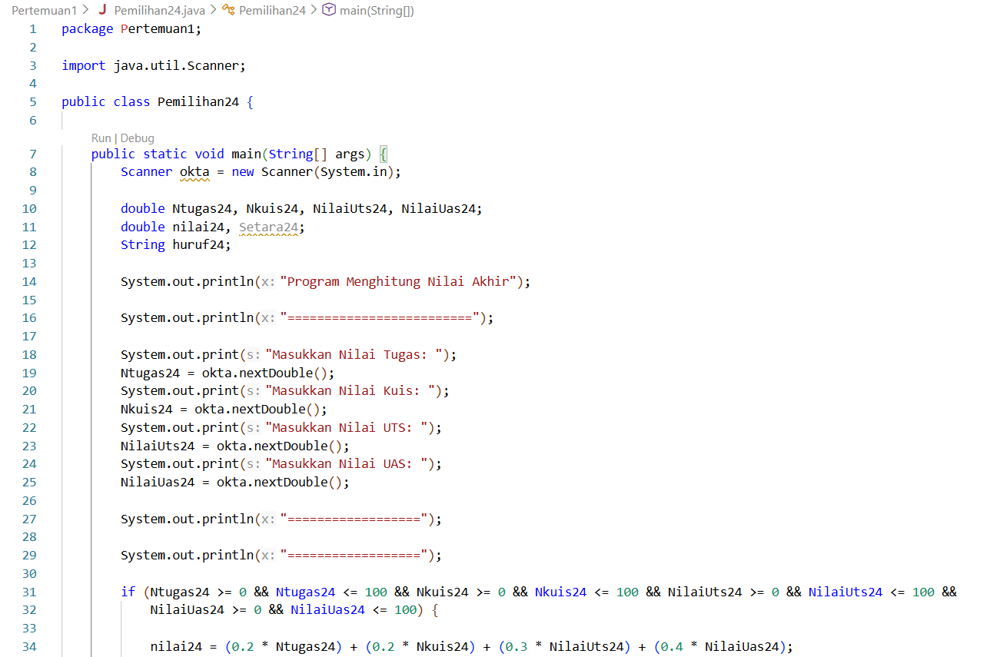

**Penjelasan:** ada 5 tahap: 
1. Input nilai
2. Validasi nilai
3. Hitung nilai
4. Konversi nilai huruf
5. output

## 2.2. Perulangan
kode berada di file Perulangan24.java, berikut adalah screenshot nya

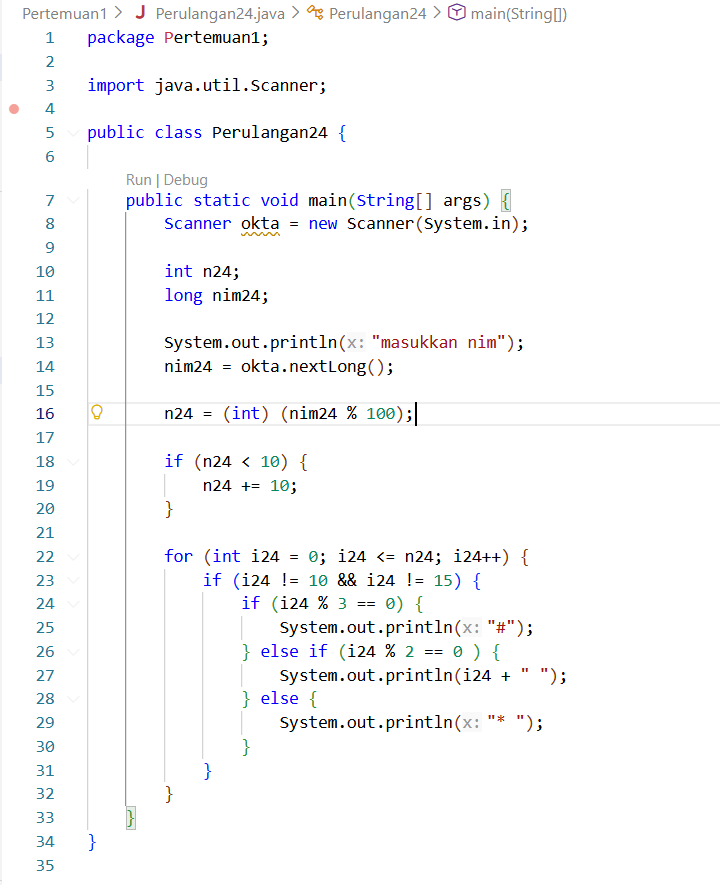
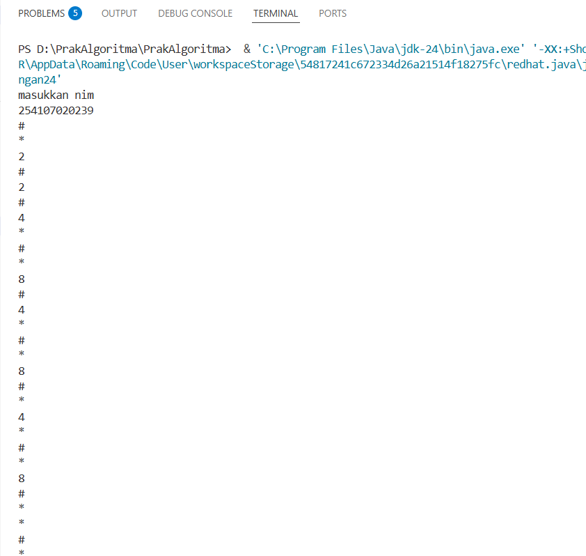

**Penjelasan:** ada 5 tahap: 
1. Input NIM
2. Menentukan nilai n
3. Validasi angka
4. Kondisi angka
5. output

## 2.3. Array
kode berada di file Array24.java, berikut adalah screenshot nya

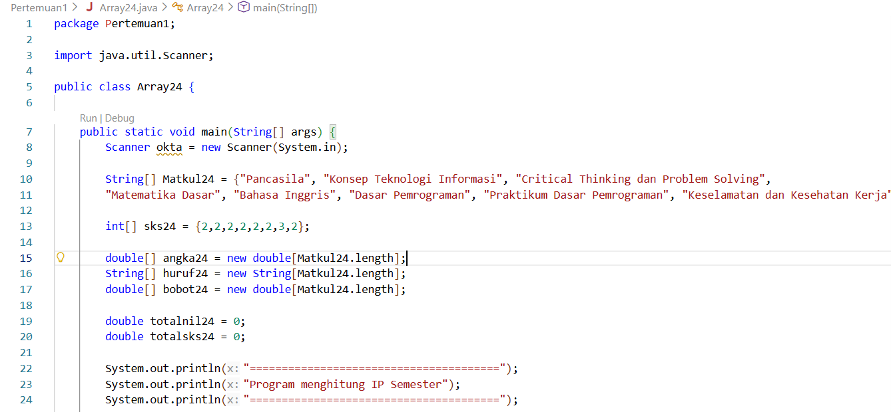
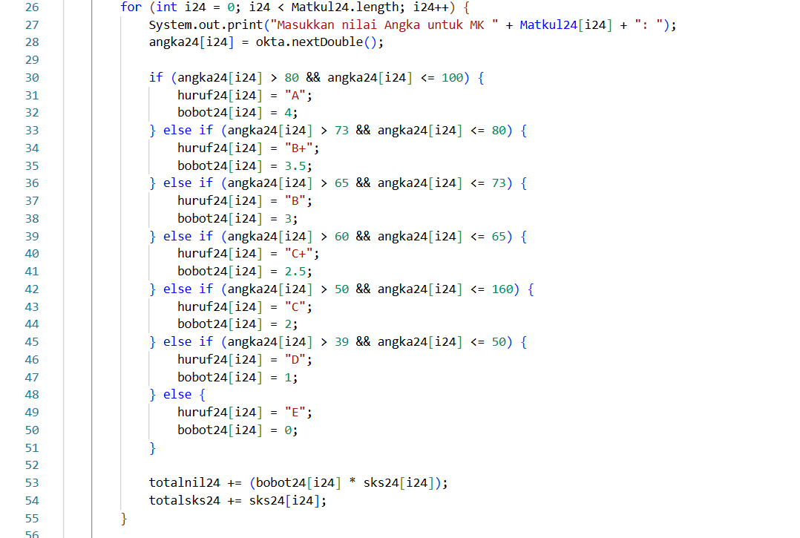
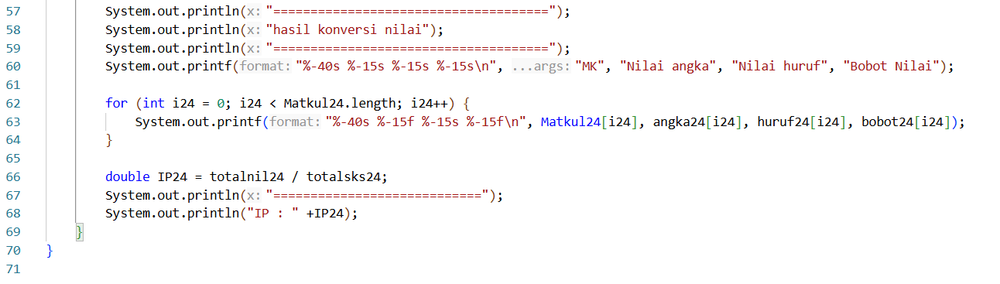

**Penjelasan:** ada 4 tahap: 
1. Input nilai
2. Hitung nilai dan konversi
3. Output
4. Hitung IP

## 2.4. Fungsi
kode berada di file Fungsi24.java, berikut adalah screenshot nya

**Penjelasan:** ada 3 tahap: 
1. Menghitung pendapatan
2. Kelompokkan pendapatan
3. Output

## Tugas 1
kode berada di file Tugas1_24.java, berikut adalah screenshot nya

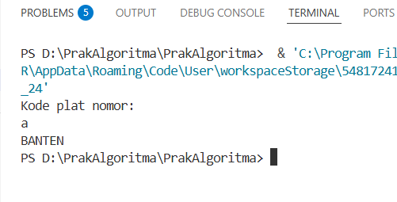

**Penjelasan:** ada 3 tahap: 
1. Input kode
2. Pencocokan kode 
3. Output

## Tugas 2
kode berada di file Tugas2_24.java, berikut adalah screenshot nya

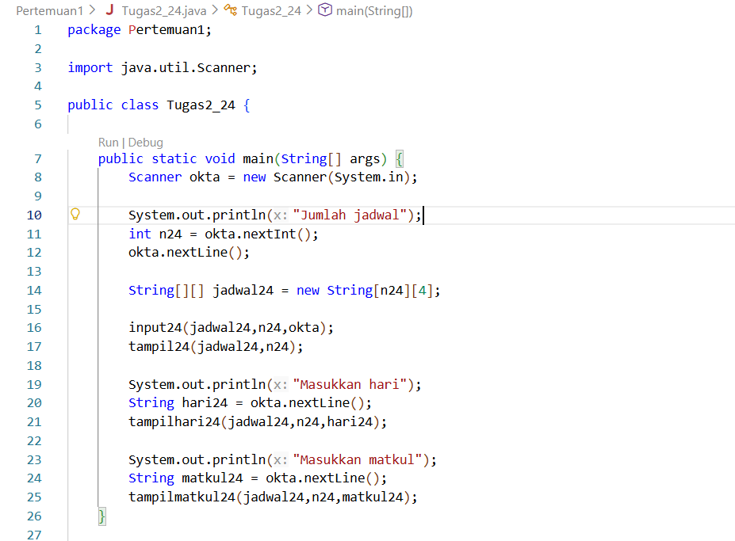
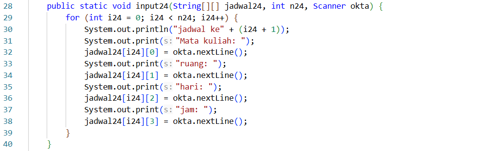

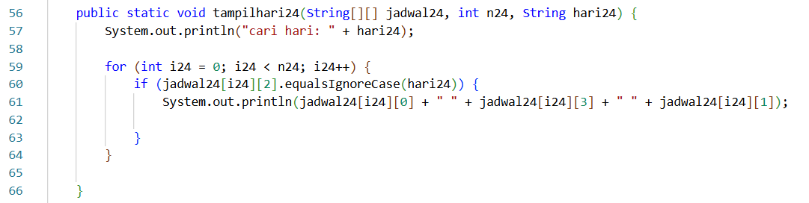
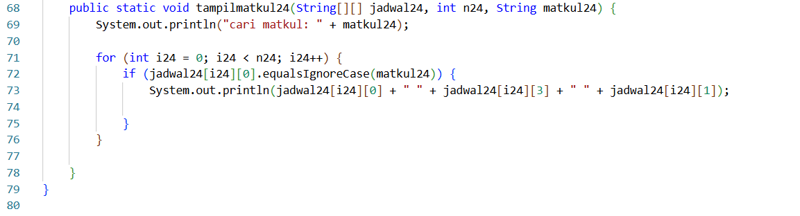
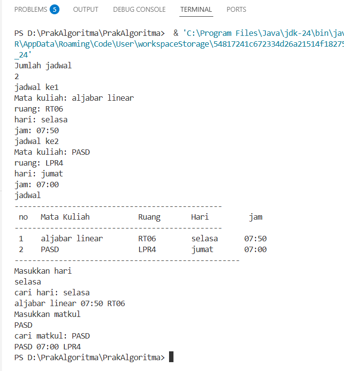

**Penjelasan:** ada 4 tahap: 
1. Input data jadwal
2. Output seluruh data
3. Pencarian berdasarkan hari tertentu
4. Pencarian berdasarkan nama mata kuliah tertentu
