|  | Algorithm and Data Structure |
|--|--|
| NIM |  254107020239|
| Nama |  Oktavian Kusuma Alghifari |
| Kelas | TI - 1F |
| Repository | [link] (https://github.com/Kakiow/PrakAlgoritma.git) |

# Labs #2 OBJECT

## 2.1. Deklarasi Class, Atribut dan Method

kode berada di file Mahasiswa24.java, berikut adalah screenshot nya

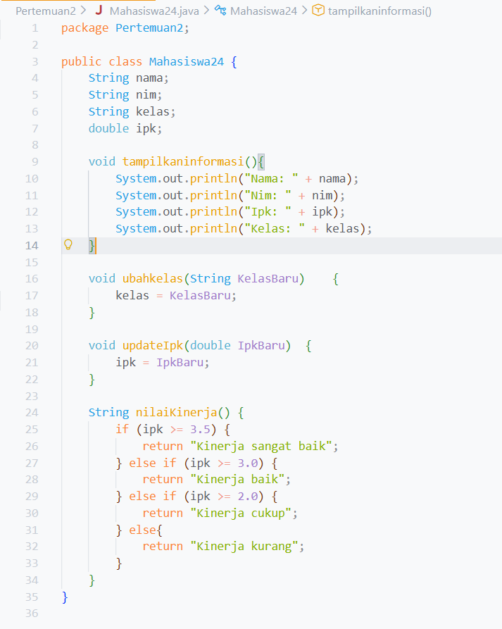

**Penjelasan:** ada 3 tahap: 
1. Membuat class
2. Deklarasi atribut
3. Deklarasi method

## 2.1.3 Pertanyaan

1. Sebutkan dua karakteristik class atau object!
   Jawab:
   sebuah class atau object memiliki atribut dan method
2. Perhatikan class Mahasiswa pada Praktikum 1 tersebut, ada berapa atribut yang dimiliki oleh class
Mahasiswa? Sebutkan apa saja atributnya!
  Jawab:
  class mahasiswa memiliki 4 atribut yaitu atribut nama,nim,kelas,ipk
3. Ada berapa method yang dimiliki oleh class tersebut? Sebutkan apa saja methodnya!
   Jawab:
   class mahasiswa memiliki 4 method yaitu method tampilkaninformasi,ubahkelas,updateIpk,nilaiKinerja
4. Perhatikan method updateIpk() yang terdapat di dalam class Mahasiswa. Modifikasi isi method
tersebut sehingga IPK yang dimasukkan valid yaitu terlebih dahulu dilakukan pengecekan apakah
IPK yang dimasukkan di dalam rentang 0.0 sampai dengan 4.0 (0.0 <= IPK <= 4.0). Jika IPK tidak
pada rentang tersebut maka dikeluarkan pesan: "IPK tidak valid. Harus antara 0.0 dan 4.0".
  Jawab:
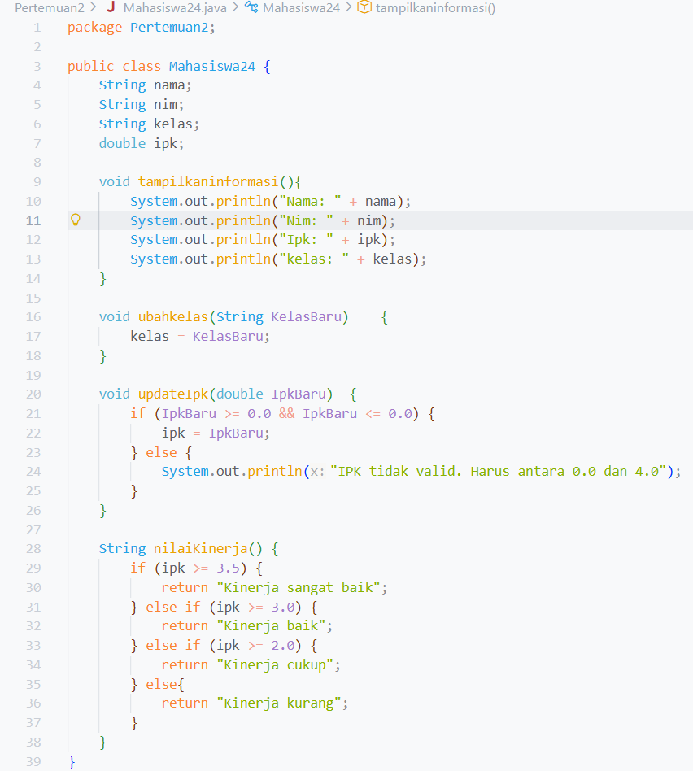
5. Jelaskan bagaimana cara kerja method nilaiKinerja() dalam mengevaluasi kinerja mahasiswa,
kriteria apa saja yang digunakan untuk menentukan nilai kinerja tersebut, dan apa yang
dikembalikan (di-return-kan) oleh method nilaiKinerja() tersebut?
  Jawab:
  cara kerja method nilaiKinerja() dengan cara melakukan cek pada nilai ipk yang di isi, jika ipk lebih dari sama dengan 3.5
  maka method nilaiKinerja() akan mengembalikan sebuah kalimat "kinerja sangat baik", jika ipk lebih dari sama dengan 3.0
  maka method nilaiKinerja() akan mengembalikan sebuah kalimat "Kinerja baik", jika ipk lebih dari sama dengan 2.0
  maka method nilaiKinerja() akan mengembalikan sebuah kalimat "kinerja cukup" jika nilai ipk selain dari itu
  maka method nilaiKinerja() akan mengembalikan sebuah kalimat "Kinerja kurang".

## 2.2. Instansiasi Object, serta Mengakses Atribut dan Method
kode berada di file MahasiswaMain24.java, berikut adalah screenshot nya

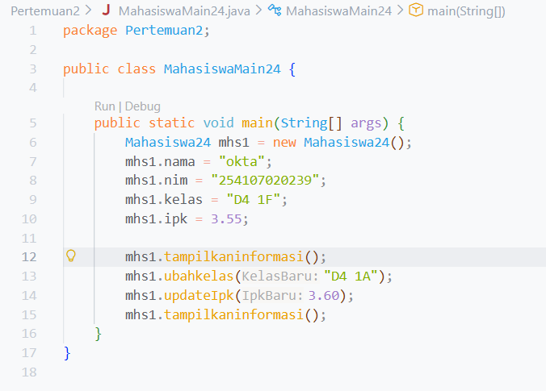
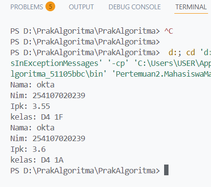

**Penjelasan:** ada 5 tahap: 
1. Membuat class main
2. Instansiasi object
3. Input nilai atribut
4. Mengakses method
5. output

## 2.2.3 Pertanyaan
1. Pada class MahasiswaMain, tunjukkan baris kode program yang digunakan untuk proses
instansiasi! Apa nama object yang dihasilkan?
  Jawab:
  
  object yang di hasilkan adalah object mhs1
2. Bagaimana cara mengakses atribut dan method dari suatu objek?
   Jawab:
   untuk mengakses atribut bisa menggunakan namaobject.namaatribut
   untuk mengakses method bisa menggunakan namaobject.namamethod
3. Mengapa hasil output pemanggilan method tampilkanInformasi() pertama dan kedua berbeda?
   Jawab:
   karena output pada pemanggilan method tampilkanInformasi() yang pertama langsung menampilkan isi atribut setelah atribut tersebut di isi nilai,
   output pada pemanggilan method tampilkanInformasi() yang kedua menampilkan nilai dari atribut object setelah atribut kelas dan ipk di ganti

## 2.3. Membuat Konstruktor
kode berada di file Mahasiswa24.java dan MahasiswaMain24.java, berikut adalah screenshot nya

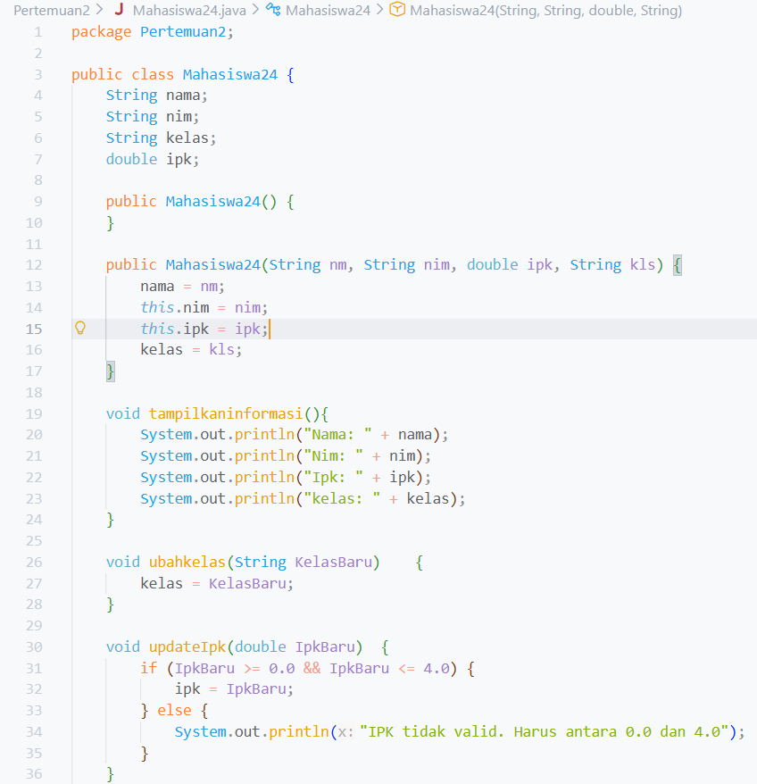
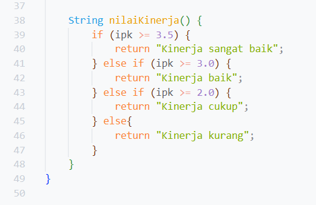
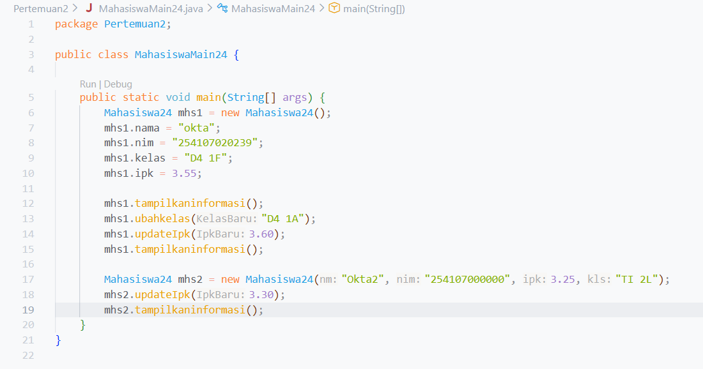

**Penjelasan:** ada 5 tahap: 
1. Membuat Konstruktor default dan Konstruktor berparameter
2. Instansiasi object
3. Mengisi nilai atribut
4. Mengakses method
5. Output

## 2.3.3 Pertanyaan
1. Pada class Mahasiswa di Percobaan 3, tunjukkan baris kode program yang digunakan untuk
mendeklarasikan konstruktor berparameter!
  Jawab:
  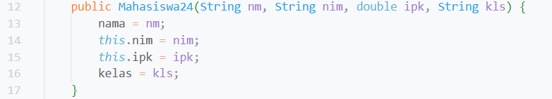
2. Perhatikan class MahasiswaMain. Apa sebenarnya yang dilakukan pada baris program
berikut?
  Jawab:
  baris kode tersebut digunakan untuk instansiasi sebuah object menggunakan class yang menggunakan konstruktor berparameter
3. Hapus konstruktor default pada class Mahasiswa, kemudian compile dan run program.
Bagaimana hasilnya? Jelaskan mengapa hasilnya demikian!
  Jawab:
  
  hasilnya konstruktor is undefined karena kontruktor default tidak pernah dideklarasikan
4. Setelah melakukan instansiasi object, apakah method di dalam class Mahasiswa harus diakses
secara berurutan? Jelaskan alasannya!
   Jawab:
   method di dalam class Mahasiswa tidak harus diakses secara berurutan, method hanya perlu di akses ketika di perlukan 
5. Buat object baru dengan nama mhs<NamaMahasiswa> menggunakan konstruktor
berparameter dari class Mahasiswa!
   Jawab:
   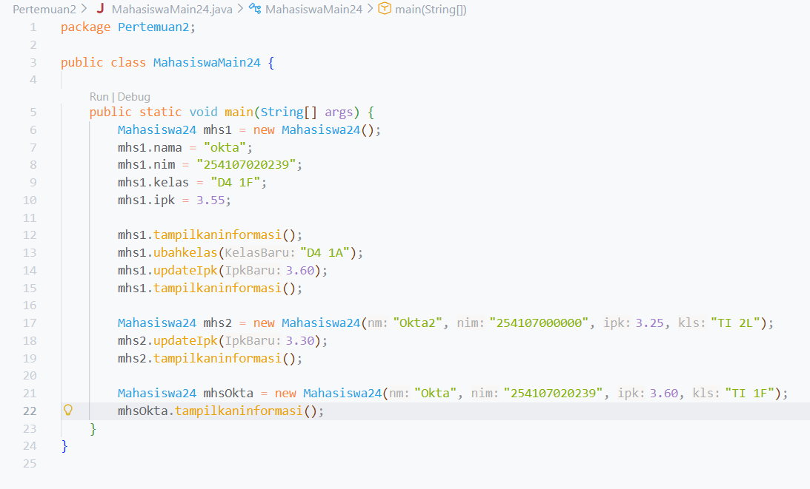
   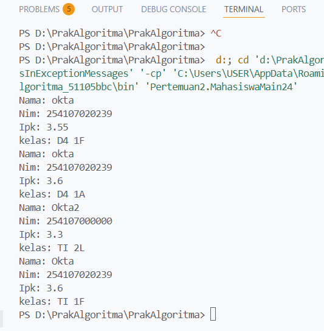

## latihan 1
kode berada di file MataKuliah24.java dan MataKuliahMain24.java, berikut adalah screenshot nya

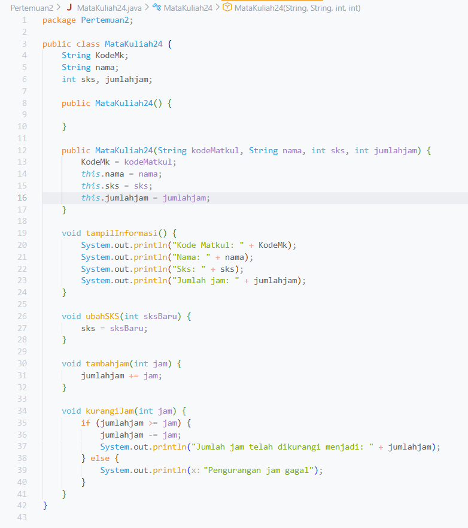
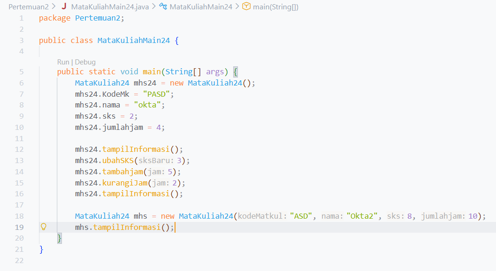
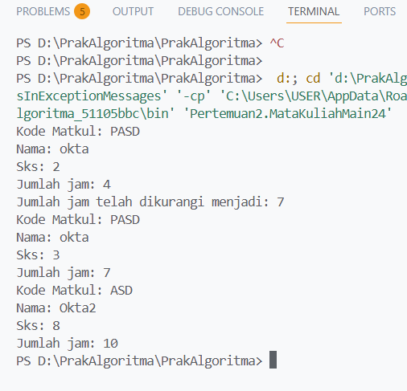

**Penjelasan:** ada 5 tahap: 
1. Membuat class main
2. Instansiasi object
3. Input nilai atribut
4. Mengakses method
5. Menghitung jam tambahan dan pengurangan jam
6. output

## latihan 2 
kode berada di file Dosen24.java dan DosenMain24.java, berikut adalah screenshot nya

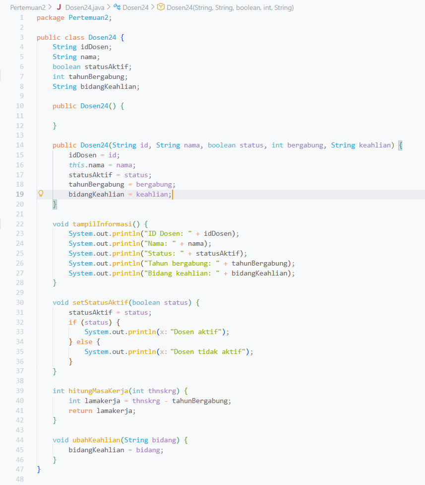
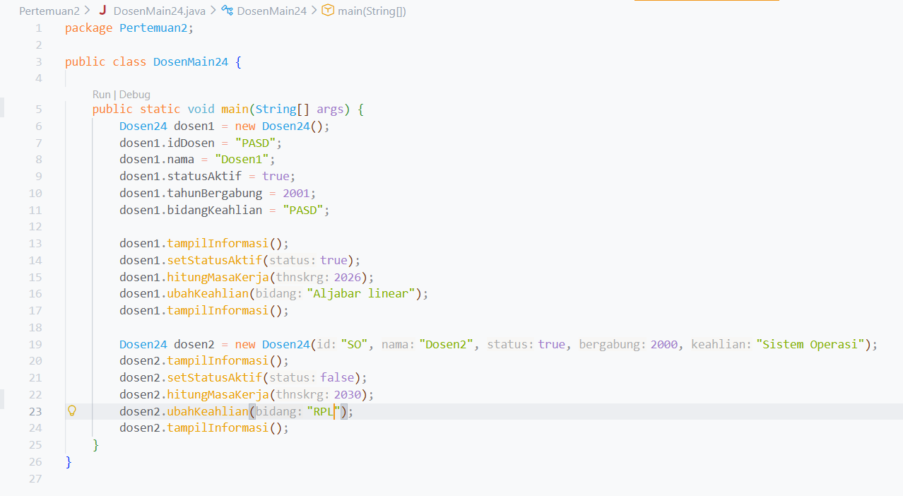
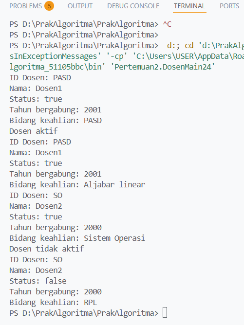

**Penjelasan:** ada 5 tahap: 
1. Membuat class main
2. Instansiasi object
3. Input nilai atribut
4. Mengakses method
5. Memeriksa status
6. Menghitung lama kerja
7. output
