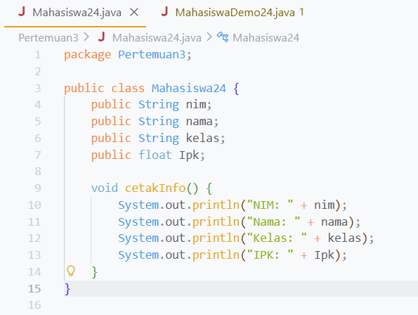
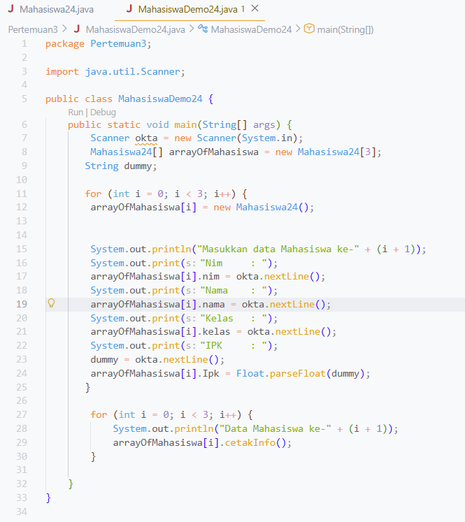

|  | Algorithm and Data Structure |
|--|--|
| NIM |  254107020239|
| Nama |  Oktavian Kusuma Alghifari |
| Kelas | TI - 1F |
| Repository | [link] (https://github.com/Kakiow/PrakAlgoritma.git) |

# Labs #3 ARRAY OF OBJECTS

## 3.2.  Membuat Array dari Object, Mengisi dan Menampilkan

kode berada di file Mahasiswa24.java dan MahasiswaDemo24.java, berikut adalah output nya

```
Nim         :254107020239
Nama        :Okta
Kelas       :TI 1F
IPK         :3.33
---------------------------------------
Nim         :25410702023912312432
Nama        :Okta2
Kelas       :TI 1F
IPK         :3.53
---------------------------------------
Nim         :25410702023924234
Nama        :Okta3
Kelas       :TI 1F
IPK         :3.93
---------------------------------------
```


**Penjelasan:** ada 4 tahap: 
1. Membuat class
2. Deklarasi atribut
3. Deklarasi method
4. Membuat class main nya dan mengakses method nya

## 3.2.3 Pertanyaan

1. Berdasarkan uji coba 3.2, apakah class yang akan dibuat array of object harus selalu memiliki
atribut dan sekaligus method? Jelaskan!
Jawab:
Class yang akan dibuat array of object tidak harus selalu memiliki atribut method sekaligus, karena method hanya akan digunakan ketika nilai dari atribut object akan di proses lagi 
2. Apa yang dilakukan oleh kode program berikut?
   Mahasiswa24[] arrayOfMahasiswa = new Mahasiswa24[3];
   Jawab:
   Kode program tersebut digunakan untuk melakukan deklarasi dan instansiasi array of object
3. Apakah class Mahasiswa memiliki konstruktor? Jika tidak, kenapa bisa dilakukan pemanggilan
konstruktur pada baris program berikut?
arrayOfMahasiswa[0] = new Mahasiswa24();
Jawab:
Class mahasiswa memiliki konstruktor,tetapi konstruktor tersebut adalah kontsruktor kosong bukan konstruktor berparameter.Konstruktor bisa di panggil karena kontruktor tersebut tetap valid walaupun konstruktor tersebut adalah kontsruktor kosong bukan konstruktor berparameter
4. Apa yang dilakukan oleh kode program berikut?
        arrayOfMahasiswa[0] = new Mahasiswa24();
        arrayOfMahasiswa[0].nim = "254107020239";
        arrayOfMahasiswa[0].nama = "Okta";
        arrayOfMahasiswa[0].kelas = "TI 1F";
        arrayOfMahasiswa[0].Ipk = (float) 3.33;
   Jawab:
   Kode program tersebut melakukan instansiasi object untuk indeks 0 dan mengisi setiap atribut object indeks ke 0
5. Mengapa class Mahasiswa dan MahasiswaDemo dipisahkan pada uji coba 3.2?
    Jawab:
   Class Mahasiswa digunakan untuk deklarasi atribut,class mahasiswa demo digunakan untuk deklarasi dan instansiasi array kemudian instansiasi object dan mengisi setiap atribut object.


## 3.3.  Menerima Input Isian Array Menggunakan Looping
kode berada di file MahasiswaDemo24.java, berikut adalah output nya
```
Masukkan data Mahasiswa ke-1
Nim     : 254107020239
Nama    : okta
Kelas   : 1F   
IPK     : 3.60
Masukkan data Mahasiswa ke-2
Nim     : 23445654
Nama    : okta2
Kelas   : 1j
IPK     : 3.50
Masukkan data Mahasiswa ke-3
Nim     : 253456546
Nama    : okta3
Kelas   : 1K
IPK     : 3.42
Data Mahasiswa ke-1
Nim            : 254107020239
Nama           : okta
Kelas          : 1F
Ipk            : 3.6
--------------------------------------
Data Mahasiswa ke-2
Nim            : 23445654
Nama           : okta2
Kelas          : 1j
Ipk            : 3.5
--------------------------------------
Data Mahasiswa ke-3
Nim            : 253456546
Nama           : okta3
Kelas          : 1K
Ipk            : 3.42
--------------------------------------
```

**Penjelasan:** ada 4 tahap: 
1. Membuat class
2. Deklarasi atribut
3. Deklarasi method
4. Membuat class main nya dan mengakses method nya

## 3.3.3 Pertanyaan
1. Tambahkan method cetakInfo() pada class Mahasiswa kemudian modifikasi kode program
pada langkah no 3.
Jawab:


```
Masukkan data Mahasiswa ke-1
Nim     : 2345235345
Nama    : okta
Kelas   : 1F
IPK     : 3.60
Masukkan data Mahasiswa ke-2
Nim     : 23452352  
Nama    : okta2
Kelas   : 1L
IPK     : 3.20
Masukkan data Mahasiswa ke-3
Nim     : 235235345
Nama    : okta3
Kelas   : 1K
IPK     : 3.40
Data Mahasiswa ke-1
NIM: 2345235345
Nama: okta
Kelas: 1F
IPK: 3.6
Data Mahasiswa ke-2
NIM: 23452352
Nama: okta2
Kelas: 1L
IPK: 3.2
Data Mahasiswa ke-3
NIM: 235235345
Nama: okta3
Kelas: 1K
IPK: 3.4
```
2. Misalkan Anda punya array baru bertipe array of Mahasiswa dengan nama
myArrayOfMahasiswa. Mengapa kode berikut menyebabkan error?
Jawab:
Karena pada kode tersebut tidak ada instansiasi object sehingga ketika kita mmengisi nilai atribut object indeks 0 maka akan terjadi error

## 3.4. Constructor Berparameter
kode berada di file Matakuliah24.java dan MatakuliahDemo24.java, berikut adalah output nya
```
Masukkan data Matakuliah ke-1
Kode            :12345
Nama            :Algoritma dan struktur data
Sks             :2
Jumlah jam      :6
-------------------------------------
Masukkan data Matakuliah ke-2
Kode            :1234567
Nama            :basis data
Sks             :2
Jumlah jam      :4
-------------------------------------
Masukkan data Matakuliah ke-3
Kode            :12345678
Nama            :dasar pemrograman
Sks             :2
Jumlah jam      :6
-------------------------------------
Data Matakuliah ke- 1
Kode              :12345
Nama              :Algoritma dan struktur data
Sks               :2
Jumlah jam        :6
Data Matakuliah ke- 2
Kode              :1234567
Nama              :basis data
Sks               :2
Jumlah jam        :4
Data Matakuliah ke- 3
Kode              :12345678
Nama              :dasar pemrograman
Sks               :2
Jumlah jam        :6
```


**Penjelasan:** ada 4 tahap: 
1. Membuat class
2. Deklarasi atribut
3. Deklarasi method
4. Membuat class main nya dan mengakses method nya

## 3.4.3 Pertanyaan
1. Apakah suatu class dapat memiliki lebih dari 1 constructor? Jika iya, berikan contohnya
   Jawab:
   Suatu class dapat memiliki lebih dari 1 konstruktor, contohnya pada class produk terdapat 2 konstruktor, konstruktor kosong untuk stok barang dan konstruktor
   berparameter untuk harga barang jika kita ingin memberi nilai harga barang dari awal
2. Tambahkan method tambahData() pada class Matakuliah, kemudian gunakan method
tersebut di class MatakuliahDemo untuk menambahkan data Matakuliah
Jawab:
```
package Pertemuan3;

import java.util.Scanner;

public class MataKuliah24 {
    public String kode;
    public String nama;
    public int sks;
    public int jumlahjam;

    Scanner okta = new Scanner(System.in);

    public MataKuliah24() {

    }

    public MataKuliah24(String kode,String nama,int sks,int jumlahjam) {
        this.kode = kode;
        this.nama = nama;
        this.sks = sks;
        this.jumlahjam = jumlahjam;
    }

    void tambahData() {
        System.out.print("Kode              :");
        this.kode = okta.nextLine();
        System.out.print("Nama              :");
        this.nama = okta.nextLine();
        System.out.print("SKS               :");
        this.sks = okta.nextInt();
        System.out.print("Jumlah jam        :");
        this.jumlahjam = okta.nextInt();
        okta.nextLine();
    }
}
```
```
package Pertemuan3;

import java.util.Scanner;

public class MataKuliahDemo24 {
    
    public static void main(String[] args) {
        Scanner okta = new Scanner(System.in);
        MataKuliah24[] arrayOfMatakuliah = new MataKuliah24[3];
        

        for (int i = 0; i < 3; i++) {
            System.out.println("Masukkan data Matakuliah ke-" + (i + 1));
            arrayOfMatakuliah[i] = new MataKuliah24();

            arrayOfMatakuliah[i].tambahData();
        }

        for (int i = 0; i < 3; i++) {
            System.out.println("Data Matakuliah ke- " + (i + 1));
            System.out.println("Kode              :" + arrayOfMatakuliah[i].kode);
            System.out.println("Nama              :" + arrayOfMatakuliah[i].nama);
            System.out.println("Sks               :" + arrayOfMatakuliah[i].sks);
            System.out.println("Jumlah jam        :" + arrayOfMatakuliah[i].jumlahjam);
        }
    }
}
```
3. Tambahkan method cetakInfo() pada class Matakuliah, kemudian gunakan method
tersebut di class MatakuliahDemo untuk menampilkan data hasil inputan di layar
Jawab:
```
package Pertemuan3;

import java.util.Scanner;

public class MataKuliah24 {
    public String kode;
    public String nama;
    public int sks;
    public int jumlahjam;

    Scanner okta = new Scanner(System.in);

    public MataKuliah24() {

    }

    public MataKuliah24(String kode,String nama,int sks,int jumlahjam) {
        this.kode = kode;
        this.nama = nama;
        this.sks = sks;
        this.jumlahjam = jumlahjam;
    }

    void tambahData() {
        System.out.print("Kode              :");
        this.kode = okta.nextLine();
        System.out.print("Nama              :");
        this.nama = okta.nextLine();
        System.out.print("SKS               :");
        this.sks = okta.nextInt();
        System.out.print("Jumlah jam        :");
        this.jumlahjam = okta.nextInt();
        okta.nextLine();
    }

    void cetakInfo() {
        System.out.println("Kode                   :" + this.kode);
        System.out.println("Nama                   :" + this.nama);
        System.out.println("SKS                    :" + this.sks);
        System.out.println("Jumlah jam             :" + this.jumlahjam);
    }
}
```
```
package Pertemuan3;

import java.util.Scanner;

public class MataKuliahDemo24 {
    
    public static void main(String[] args) {
        Scanner okta = new Scanner(System.in);
        MataKuliah24[] arrayOfMatakuliah = new MataKuliah24[3];
        

        for (int i = 0; i < 3; i++) {
            System.out.println("Masukkan data Matakuliah ke-" + (i + 1));
            arrayOfMatakuliah[i] = new MataKuliah24();

            arrayOfMatakuliah[i].tambahData();
        }

        for (int i = 0; i < 3; i++) {
            System.out.println("Data Matakuliah ke- " + (i + 1));
            arrayOfMatakuliah[i].cetakInfo();
        }
    }
}
```
4. Modifikasi kode program pada class MatakuliahDemo agar panjang (jumlah elemen) dari
array of object Matakuliah ditentukan oleh user melalui input dengan Scanner
Jawab:
```
package Pertemuan3;

import java.util.Scanner;

public class MataKuliahDemo24 {
    
    public static void main(String[] args) {
        Scanner okta = new Scanner(System.in);
        int matkul24;

        System.out.println("Jumlah elemen: ");
        matkul24 = okta.nextInt();

        MataKuliah24[] arrayOfMatakuliah = new MataKuliah24[matkul24];
        

        for (int i = 0; i < matkul24; i++) {
            System.out.println("Masukkan data Matakuliah ke-" + (i + 1));
            arrayOfMatakuliah[i] = new MataKuliah24();

            arrayOfMatakuliah[i].tambahData();
        }

        for (int i = 0; i < matkul24; i++) {
            System.out.println("Data Matakuliah ke- " + (i + 1));
            arrayOfMatakuliah[i].cetakInfo();
        }
    }
}
```


## Tugas 1
kode berada di file MataKuliah24.java dan MataKuliahMain24.java, berikut adalah screenshot nya
```
package Pertemuan3;

public class Dosen24 {
    String kode;
    String nama;
    Boolean JenisKelamin;
    int usia;

    public Dosen24(String kode, String nama, Boolean JenisKelamin, int usia) {
        this.kode = kode;
        this.nama = nama;
        this.JenisKelamin = JenisKelamin;
        this.usia = usia;
    }
}
```
```
package Pertemuan3;

import java.util.Scanner;

public class DosenDemo24 {
    public static void main(String[] args) {
        Scanner okta = new Scanner(System.in);
        String nama,kode,jeniskel;
        int usia;
        boolean JenisKelamin;

        Dosen24[] arrayDosen = new Dosen24[3];

        for (int i = 0; i < 3; i++) {
            System.out.println("Masukkan Data Dosen Ke- " + (i + 1));
            System.out.print("Kode                 :");
            kode = okta.nextLine();
            System.out.print("Nama                 :");
            nama = okta.nextLine();
            System.out.print("Jenis Kelamin        :");
            jeniskel = okta.nextLine();
            JenisKelamin = jeniskel.equalsIgnoreCase("Pria");
            System.out.print("Usia                 :");
            usia= okta.nextInt();
            okta.nextLine();

            arrayDosen[i] = new Dosen24(kode, nama, JenisKelamin, usia);
        }

        int i = 1;
        for (Dosen24 data : arrayDosen) {
            System.out.println("Data Dosen Ke-" + i);
            System.out.println("Kode                 :" + data.kode);
            System.out.println("Nama                 :" + data.nama);
            System.out.println("Jenis Kelamin        :" + (data.JenisKelamin ? "Pria" : "wanita"));
            System.out.println("Usia                 :" + data.usia);
            i++;
        }
    }
}
```
```
Masukkan Data Dosen Ke- 1
Kode                 :test
Nama                 :test
Jenis Kelamin        :pria
Usia                 :23
Masukkan Data Dosen Ke- 2
Kode                 :test2
Nama                 :test2
Jenis Kelamin        :wanita
Usia                 :34
Masukkan Data Dosen Ke- 3
Kode                 :test3
Nama                 :test3
Jenis Kelamin        :wanita
Usia                 :32
Data Dosen Ke-1
Kode                 :test
Nama                 :test
Jenis Kelamin        :Pria
Usia                 :23
Data Dosen Ke-2
Kode                 :test2
Nama                 :test2
Jenis Kelamin        :wanita
Usia                 :34
Data Dosen Ke-3
Kode                 :test3
Nama                 :test3
Jenis Kelamin        :wanita
Usia                 :32
```

**Penjelasan:** ada 4 tahap: 
1. Membuat class
2. Deklarasi atribut
3. Deklarasi method
4. Membuat class main nya dan mengakses method nya

## Tugas 2 
kode berada di file Dosen24.java dan DosenMain24.java, berikut adalah screenshot nya
```
package Pertemuan3;

public class DataDosen24 {
    
    public static void dataSemuaDosen(Dosen24[] arrayOfDosen) {
        for (int i = 0; i < 3; i++) {
            System.out.println("Data Dosen Ke-" + i);
            System.out.println("Kode                 :" + arrayOfDosen[i].kode);
            System.out.println("Nama                 :" + arrayOfDosen[i].nama);
            System.out.println("Jenis Kelamin        :" + (arrayOfDosen[i].JenisKelamin ? "Pria" : "wanita"));
            System.out.println("Usia                 :" + arrayOfDosen[i].usia);
            System.out.println("-------------------------------------------");
        }
    }

    public static void jumlahDosenPerJenisKelamin(Dosen24[] arrayOfDosen) {
        int pria = 0;
        int wanita = 0;
        for (int i = 0; i < 3; i++) {
            if (arrayOfDosen[i].JenisKelamin) {
                pria++;
            } else {
                wanita++;
            }
        }
        
        System.out.println("Jumlah Pria     : " + pria);
        System.out.println("Jumlah Wanita   : " + wanita);
    }

    public static void ratarataUsiaDosenPerJenisKelamin(Dosen24[] arrayOfDosen) {
        int totalpria = 0;
        int totalwanita = 0;
        int pria = 0;
        int wanita = 0;
        for (int i = 0; i < 3; i++) {
            if (arrayOfDosen[i].JenisKelamin) {
                totalpria += arrayOfDosen[i].usia;
                pria++;
            } else {
                totalwanita += arrayOfDosen[i].usia;
                wanita++;
            }
        }
        System.out.println("-------------------------------------------");
        System.out.println("Rata-rata Usia Dosen Pria  : " + (double) totalpria / pria);
        System.out.println("Rata-rata Usia Dosen Wanita: " + (double) totalwanita / wanita);
    }

    public static void infoDosenPalingTua(Dosen24[] arrayOfDosen) {
        int tertua = 0;
        for (int i = 1; i < 3; i++) {
            if (arrayOfDosen[i].usia > arrayOfDosen[tertua].usia) {
                tertua = i;
            }
        }
        System.out.println("-------------------------------------------");
        System.out.println("Dosen Tertua");
        System.out.println("Kode     :" + arrayOfDosen[tertua].kode);
        System.out.println("Nama     :" + arrayOfDosen[tertua].nama);
    }

    public static void infoDosenPalingMuda(Dosen24[] arrayOfDosen) {
        int termuda = 0;
        for (int i = 1; i < 3; i++) {
            if (arrayOfDosen[i].usia < arrayOfDosen[termuda].usia) {
                termuda = i;
            }
        }
        System.out.println("-------------------------------------------");
        System.out.println("Dosen Termuda");
        System.out.println("Kode     :" + arrayOfDosen[termuda].kode);
        System.out.println("Nama     :" + arrayOfDosen[termuda].nama);
    }
}
```
```
package Pertemuan3;

import java.util.Scanner;

public class DosenDemo24 {
    public static void main(String[] args) {
        Scanner okta = new Scanner(System.in);
        String nama,kode,jeniskel;
        int usia;
        boolean JenisKelamin;

        Dosen24[] arrayDosen = new Dosen24[3];

        for (int i = 0; i < 3; i++) {
            System.out.println("Masukkan Data Dosen Ke- " + (i + 1));
            System.out.print("Kode                 :");
            kode = okta.nextLine();
            System.out.print("Nama                 :");
            nama = okta.nextLine();
            System.out.print("Jenis Kelamin        :");
            jeniskel = okta.nextLine();
            JenisKelamin = jeniskel.equalsIgnoreCase("Pria");
            System.out.print("Usia                 :");
            usia= okta.nextInt();
            okta.nextLine();

            arrayDosen[i] = new Dosen24(kode, nama, JenisKelamin, usia);
        }

        DataDosen24.dataSemuaDosen(arrayDosen);
        DataDosen24.jumlahDosenPerJenisKelamin(arrayDosen);
        DataDosen24.ratarataUsiaDosenPerJenisKelamin(arrayDosen);
        DataDosen24.infoDosenPalingTua(arrayDosen);
        DataDosen24.infoDosenPalingMuda(arrayDosen);
    }
}
```
```
Masukkan Data Dosen Ke- 1
Kode                 :test       
Nama                 :test
Jenis Kelamin        :pria
Usia                 :34
Masukkan Data Dosen Ke- 2
Kode                 :test2
Nama                 :test2
Jenis Kelamin        :wanita
Usia                 :27
Masukkan Data Dosen Ke- 3
Kode                 :test3
Nama                 :okta
Jenis Kelamin        :pria
Usia                 :30
Data Dosen Ke-0
Kode                 :test
Nama                 :test
Jenis Kelamin        :Pria
Usia                 :34
-------------------------------------------
Data Dosen Ke-1
Kode                 :test2
Nama                 :test2
Jenis Kelamin        :wanita
Usia                 :27
-------------------------------------------
Data Dosen Ke-2
Kode                 :test3
Nama                 :okta
Jenis Kelamin        :Pria
Usia                 :30
-------------------------------------------
Jumlah Pria     : 2
Jumlah Wanita   : 1
-------------------------------------------
Rata-rata Usia Dosen Pria  : 32.0
Rata-rata Usia Dosen Wanita: 27.0
-------------------------------------------
Dosen Tertua
Kode     :test
Nama     :test
-------------------------------------------
Dosen Termuda
Kode     :test2
Nama     :test2
```

**Penjelasan:** ada 4 tahap: 
1. Membuat class
2. Deklarasi atribut
3. Deklarasi method
4. Membuat class main nya dan mengakses method nya
